# OpenTelemetry 可觀測性的未來 
本報告譯⾃ O'Reilly 出品的 [The Future of Observablity with OpeTelemetry](https://www.oreilly.com/library/view/the-future-of/9781098118433/)，作者 Ted Young，簡體中文譯者 [Jimmy Song](https://jimmysong.io/)，繁體中文譯者 Marcus Tung。

# 關於作者
Ted Young 是 OpenTelemetry 項⽬的聯合創始⼈之⼀。在過去的⼆⼗年⾥，他設計 並建⽴了各種⼤規模的分佈式系統，包括可視化 FX 管道和容器調度系統。他⽬前 在 Lightstep 公司擔任開發者教育總監，住在俄勒岡州波特蘭的⼀個⼩農場⾥。

# 許可證
您可以使⽤[署名 - ⾮商業性使⽤ - 相同⽅式共享 4.0 (CC BY-NC-SA 4.0)](https://creativecommons.org/licenses/by-nc-sa/4.0/deed.zh) 協議共享。

# 前言

軟體開發的模式又一次改變了。開源套件和公有云供應商已經從根本上改變了我們構建和部署軟體的方式。有了開源套件，我們的應用不再需要從頭開始編碼。而通過使用公有云供應商，我們不再需要配置服務器或連接網絡設備。所有這些都意味著，你可以在短短幾天甚至幾小時內從頭開始構建和部署一個應用程序。

但是，僅僅因為部署新的應用程序很容易，並不意味著操作和維護它們也變得更容易。隨著應用程序變得更加複雜，更加異質，最重要的是，更加分佈式，看清大局，以及準確地指出問題發生的地方，變得更加困難。

但有些事情並沒有改變：作為開發者和維運，我們仍然需要能夠從用戶的角度理解應用程序的性能，我們仍然需要對用戶的事務有一個端到端的看法。我們也仍然需要衡量和說明在處理這些事務的過程中資源是如何被消耗的。也就是說，我們仍然需要可觀測性。

但是，儘管對可觀測性的需求沒有改變，我們實施可觀測性解決方案的方式必須改變。本報告詳細介紹了關於可觀測性的傳統思維方式對現代應用程式的不足：繼續將可觀測性作為一系列工具（尤其是作為 "三大支柱"）來實施，幾乎不可能以可靠的方式運行現代應用。

OpenTelemetry 通過提供一種綜合的方法來收集有關應用程序行為和性能的數據，包括指標、日誌和追蹤，來解決這些挑戰。正如本報告所解釋的，OpenTelemetry 是一種生成和收集這些數據的新方法，這種方法是為使用開源套件構建的雲原生應用而設計的。

事實上，OpenTelemetry 是專門為這些開源套件設計的。與供應商特定的儀表不同，OpenTelemetry 可以直接嵌入到開放源程式碼中。這意味著開源庫的作者可以利用他們的專業知識來添加高質量的儀表，而不需要在他們的項目中增加任何解決方案或供應商特定的程式碼。

OpenTelemetry 對應用程序所有者也有好處。在過去，遙測的產生方式與它的評估、存儲和分析方式相關聯。這意味著選擇使用哪種可觀測性解決方案必須在開發過程的早期完成，並且在之後很難改變。 OpenTelemetry（就像它的前身 OpenTracing 和 OpenCensus 一樣）將你的應用程序產生遙測的方式與遙測的分析方式相隔離。

因此，當我們採用新技術時，我們往往沒有考慮到該技術將如何被使用，特別是它將如何被不同角色的人使用。本報告描述了 OpenTelemetry 如何滿足套件作者、應用程序擁有者、運維和響應者的需求，以及它如何使這些角色中的每個人都能獨立工作 —— 即自動做出關鍵決定並進行有效協作。

也許最重要的是，OpenTelemetry 為應用程式所有者和操作者提供了靈活性，使他們能夠選擇最適合其應用程式和組織需求的可觀測性解決方案，包括需要多種工具的情況。它還包括這些需求隨時間變化的情況，以及需要新的工具來滿足這些需求的情況，因為隨著技術的成熟和組織的發展，可能會出現這種情況。

雖然用戶不需要致力於可觀測性解決方案，但他們確實需要投資於生成遙測數據的一致方式。本報告展示了 OpenTelemetry 是如何被設計成範圍狹窄、可擴展，而且最重要的是穩定的：如果你被要求進行這種投資，這正是你所期望的。

與以往任何時候相比，可觀測性都不能成為事後的想法。沒有一個有效的可觀測性解決方案的風險，也就是說，無法了解你的應用程式中正在發生的事情的風險是非常高的，而對可觀測性採取錯誤的方法的成本會造成你的組織多年來一直在償還的債務。無論是長時間停機，還是開發團隊被無休止的供應商遷移所困擾，你的組織的成功都取決於像 OpenTelemetry 這樣的集成和開放的方法。

本報告提供了關於在你的組織中採用和管理 OpenTelemetry 的實用建議。它將使你開始走向成功的可觀測性實踐的道路，並釋放出雲原生和開源技術的許多真正的好處：你不僅能夠快速建立和部署應用程序，而且能夠可靠和自信地運行它們。

—— Daniel “Spoons” Spoonhower Lightstep

# 第 1 章：可觀測性的歷史

可觀測性行業正處在巨變中。

傳統上，我們觀察系統時使用的是一套筒倉式的、獨立的工具，其中大部分包含結構不良（或完全非結構化）的數據。這些獨立的工具也是垂直整合的。工具、協議和數據格式都屬於一個特定的後端或服務，不能互換。這意味著更換或採用新的工具需要耗費時間來更換整個工具鏈，而不僅僅是更換後端。

這種孤立的技術格局通常被稱為可觀測性的 "三大支柱"：日誌、指標和（幾乎沒有）追踪（見圖 1-1）。

**日誌**

記錄構成交易的各個事件。

**指標**

記錄構成一個交易的事件的集合。

**追踪**

測量操作的延遲和識別交易中的性能瓶頸，或者類似的東西。傳統上，許多組織並不使用分佈式追踪，許多開發人員也不熟悉它。

我們用這種方法工作了很久，以致於我們不常質疑它。但正如我們將看到的，"三大支柱" 並不是一種正確的結構化的可觀測性方法。事實上，這個術語只是描述了某些技術碰巧被實現的方式，它掩蓋了關於如何實際使用我們的工具的幾個基本事實。

## 什麼是交易和資源？

在我們深入探討不同可觀測性範式的利弊之前，重要的是要定義我們所觀察的是什麼。我們最感興趣的分佈式系統是基於互聯網的服務。這些系統可以被分解成兩個基本組成部分：**交易**和**資源**。

**交易（transaction）**代表了分佈式系統需要執行的所有動作，以便服務能夠做一些有用的事情。載入網頁，購買裝滿物品的購物車，訂購共享汽車：這些都是交易的例子。重要的是要理解，交易**不僅僅是**數據庫交易。對每個服務的每個請求都是交易的一部分。

例如，一個交易可能從一個瀏覽器客戶端向一個網絡代理發出 HTTP 請求開始。代理首先向認證系統發出請求以驗證用戶，然後將請求轉發給前端應用服務器。應用服務器向各種數據庫和後端系統發出若干請求。例如，一個消息系統：Kafka 或 AMQP，被用來排隊等待異步處理的額外工作。所有這些工作都必須正確完成，以便向急切等待的用戶提供結果。如果任何部分失敗或耗時過長，其結果就是糟糕的體驗，所以我們需要全面理解交易。

一路下來，所有這些交易都在消耗**資源（resource）**。網絡服務只能處理這麼多的並發請求，然後它們的性能就會下降並開始失效。這些服務可以擴大規模，但它們與可能調用鎖的數據庫互動，造成瓶頸。數據庫讀取記錄的請求可能會阻礙更新該記錄的請求，反之亦然。此外，所有這些資源都是要花錢的，在每個月的月底，你的基礎設施供應商會給你發賬單。你消耗的越多，你的賬單就越長。

如何解決某個問題或提高服務質量？要么是開發人員修改交易，要么是運維人員修改可用資源。就這樣了。這就是它的全部內容。當然，魔鬼就在細節中。

第四章將詳細介紹可觀測性工具表示交易和資源的理想方式。但是，讓我們回到描述迄今為止我們一直在做的非理想的方式。

> **不是所有事情都是交易**
>
> 請注意，除了跨交易之外，還有其他的計算模型。例如，桌面和移動應用程序通常是基於**反應器（reactor）**模型，用戶在很長一段時間內連續互動。照片編輯和視頻遊戲就是很好的例子，這些應用有很長的用戶會話，很難描述為離散的交易。在這些情況下，基於事件的可觀測性工具，如**真實用戶監控**（RUM），可以增強分佈式追踪，以更好地描述這些長期運行的用戶會話。
>
> 也就是說，幾乎所有基於互聯網的服務都是建立在交易模式上的。由於這些是我們關注的服務，觀察交易是我們在本書中描述的內容。附錄 B 中對 RUM 進行了更詳細的描述。

## 可觀測性的三大支柱

考慮到交易和資源，讓我們來看看三大支柱模式。將這種關注點的分離標記為 "三大支柱"，聽起來是有意的，甚至是明智的。支柱聽起來很嚴肅，就像古代雅典的帕特農神廟。但這種安排實際上是一個意外。計算機的可觀測性由多個孤立的、垂直整合的工具鏈組成，其真正的原因只是一個平庸的故事。

這裡有一個例子。假設有一個人想了解他們的程序正在執行的交易。所以他建立了一個日誌工具：一個用於記錄包含時間戳的消息的接口，一個用於將這些消息發送到某個地方的協議，以及一個用於存儲和檢索這些消息的數據系統。這足夠簡單。

另一個人想監測在任何特定時刻使用的所有資源；他想捕捉指標。那麼，他不會為此使用日誌系統，對嗎？他想追踪一個數值是如何隨時間變化的，並跨越一組有限的維度。很明顯，一大堆非結構化的日誌信息與這個問題沒有什麼關係。因此，一個新的、完全獨立的系統被創造出來，解決了生成、傳輸和存儲度量的具體問題。

另一個人想要識別性能瓶頸。同樣，日誌系統的非結構化性質使它變得無關緊要。識別性能瓶頸，比如一連串可以並行運行的操作，需要我們知道交易中每個操作的持續時間以及這些操作是如何關聯在一起的。因此，我們建立了一個完全獨立的追踪系統。由於新的追踪系統並不打算取代現有的日誌系統，所以追踪系統被大量抽樣，以限制在生產中運行第三個可觀測系統的成本。

這種零敲碎打的可觀測性方法是人類工程的一個完全自然和可理解的過程。然而，它有其局限性，不幸的是，這些局限性往往與我們在現實世界中使用（和管理）這些系統的方式相悖。

## 實際上我們如何觀察系統？

讓我們來看看運維人員在調查問題時所經歷的實際的、不加修飾的過程。

調查包括兩個步驟：注意到有事情發生，然後確定是什麼原因導致了它的發生。

當我們執行這些任務時，我們使用可觀測性工具。但是，重要的是，我們並不是孤立地使用每一個工具。我們把它們全部放在一起使用。而在整個過程中，這些工具的孤立性給操作者帶來了巨大的認知負擔。

通常情況下，當有人注意到一個重要的指標**變得歪七扭八時，**調查就開始了。在這種情況下，"毛刺" 是一個重要的術語，因為運維人員在這一點上所掌握的唯一信息是儀錶盤上一條小線的形狀，以及他們自己對該線的形狀是否看起來 "正確" 的內部評估（圖 1-2）。

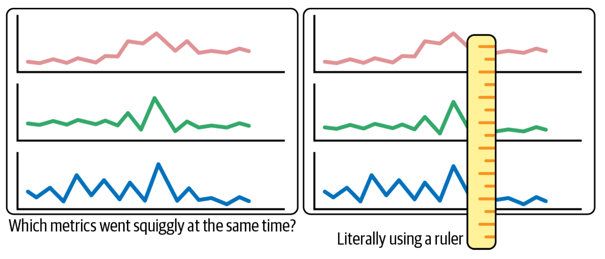

在確定了線的形狀開始看起來 "不對勁" 的那一點後，運維人員將瞇起眼睛，試圖找到儀表板上同時出現 "毛刺" 的其他線。然而，由於這些指標是完全相互獨立的，運維人員必須在他們的大腦中進行比較，而不需要計算機的幫助。

不用說，盯著圖表，希望找到一個有用的關聯，需要時間和腦力，更不用說會導致眼睛疲勞。

就個人而言，我會用一把尺子或一張紙，只看什麼東西排成一排。在 "現代" 儀錶盤中，標尺現在是作為用戶界面的一部分而繪製的線。但這只是一個粗略的解決方案。識別相關性的真正工作仍然必鬚髮生在操作者的頭腦中，同樣沒有計算機的幫助。

在對問題有了初步的、粗略的猜測後，運維人員通常開始調查他們認為可能與問題有關的交易（日誌）和資源（機器、進程、配置文件）（圖 1-3）。

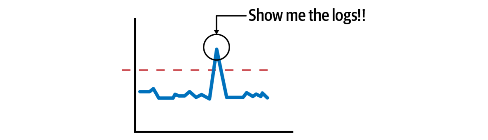

在這裡，計算機也沒有真正的幫助。日誌存儲在一個完全獨立的系統中，不能與任何指標儀表板自動關聯。配置文件和其他服務的具體信息通常**不在任何系統**中，運維人員必須通過 SSH 或其他方式訪問運行中的機器來查看它們。

因此，運維人員再次被留下尋找相關性的工作，這次是在指標和相關日誌之間。識別這些日誌可能很困難；通常必須查閱源程式碼才能了解可能存在的日誌。

當找到一個（可能是，希望是）相關的日誌，下一步通常是確定導致這個日誌產生的事件鏈。這意味著要找到同一交易中的其他日誌。

缺乏關聯性給操作者帶來了巨大的負擔。非結構化和半結構化的日誌系統沒有自動索引和按交易過濾日誌的機制。儘管這是迄今為止運維人員最常見的日誌工作流程，但他們不得不執行一系列特別的查詢和過濾，將可用的日誌篩選成一個子集，希望能代表交易的近似情況。為了成功，他們必須依靠應用程序開發人員來添加各種請求 ID 和記錄，以便日後找到並拼接起來。

在一個小系統中，這種重建交易的過程是乏味的，但卻是可能的。但是一旦系統發展到包括許多橫向擴展的服務，重建交易所需的時間就開始嚴重限制了調查的範圍。圖 1-4 顯示了一個涉及許多服務的複雜交易。你將如何收集所有的日誌？

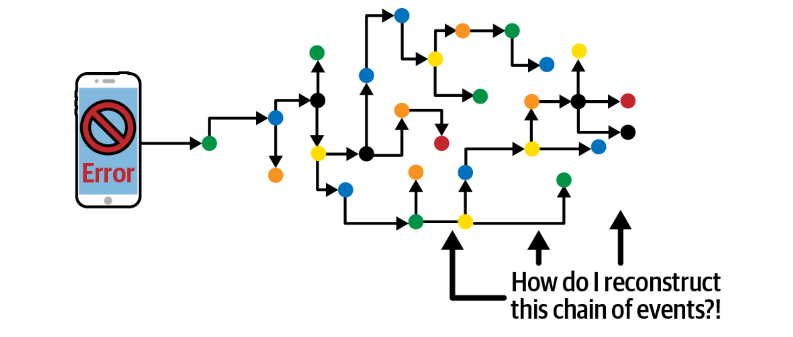

**分佈式追踪**是一個好的答案。它實際上擁有自動重建一個交易所需的所有 ID 和索引工具。不幸的是，追踪系統經常被看作是用於進行延遲分析的利基工具。因此，發送給它們的日誌數據相對較少。而且，由於它們專注於延遲分析，追踪系統經常被大量採樣，使得它們與這類調查無關。

## 不是三根柱子，而是一股繩子

不用說，這是一個無奈之舉。上述工作流程確實代表了一種可怕的狀態。但是，由於我們已經在這種技術體制下生活了這麼久，我們往往沒有認識到，與它可以做到的相比，它實際上是多麼低效。

今天，為了了解系統是如何變化的，運維人員必須首先收集大量的數據。然後，他們必須根據儀錶盤顯示和日誌掃描等視覺反饋，用他們的頭腦來識別這些數據的相關性。這是一種緊張的腦力勞動。如果一個計算機程序能夠自動掃描和關聯這些數據，那麼這些腦力勞動就是不必要的。如果運維人員能夠專注於調查他們的系統是**如何**變化的，而不需要首先確定**什麼**在變化，那麼他們將節省大量寶貴的時間。

在編寫一個能夠準確執行這種變化分析的計算機程序之前，所有這些數據點都需要被連接起來。日誌需要被連接在一起，以便識別交易。衡量標準需要與日誌聯繫在一起，這樣產生的統計數據就可以與它們所測量的交易聯繫起來。每個數據點都需要與底層系統資源 —— 軟件、基礎設施和配置細節相關聯，以便所有事件都能與整個系統的拓撲結構相關聯。

最終的結果是一個單一的、可遍歷的圖，包含了描述分佈式系統狀態所需的所有數據，這種類型的數據結構將給分析工具一個完整的系統視圖。與其說是不相連的數據的 "三根支柱"，不如說是相互連接的數據的一股繩子。

OpenTelemetry 因此誕生。如圖 1-5 所示，OpenTelemetry 是一個新的遙測系統，它以一種綜合的方式生成追踪、日誌和指標。所有這些連接的數據點以相同的協議一起傳輸，然後可以輸入計算機程序，以確定整個數據集的相關性。

這種統一的數據是什麼樣子的？在下一章，我們將把這三個支柱放在一邊，從頭開始建立一個新的模型。

# 第 2 章：結構化數據的價值

瞇著眼睛看圖表並不是尋找相關性的最佳方式。目前在運維人員頭腦中進行的大量工作實際上是可以自動化的。這使運維人員可以在識別問題、提出假設和驗證根本原因之間迅速行動。

為了建立更好的工具，我們需要更好的數據。遙測必須具備以下兩個要求以支持高質量的自動分析：

- 所有的數據點都必須用適當的索引連接在一個圖上。
- 所有代表常見操作的數據點必須有明確的鍵和值。

在這一章中，我們將從一個基本的構件開始瀏覽現代遙測數據模型：屬性。

## 屬性：定義鍵和值

最基本的數據結構是**屬性（attribute）**，定義為一個鍵和一個值。 OpenTelemetry 的每個數據結構都包含一個屬性列表。分佈式系統的每個組件（HTTP 請求、SQL 客戶端、無服務器函數、Kubernetes Pod）在 OpenTelemetry 規範中都被定義為一組特定的屬性。這些定義被稱為 OpenTelemetry **語義約定**。表 2-1 顯示了 HTTP 約定的部分列表。

| 屬性             | 類型   | 描述                                                         | 範例            |
| ---------------- | ------ | ------------------------------------------------------------ | --------------- |
| http.method      | string | HTTP 請求類型                                                | GET; POST; HEAD |
| http.target      | string | 在 HTTP 請求行中傳遞的完整的請求目標或等價物                 | /path/12314/    |
| http.host        | string | HTTP [host header](https://datatracker.ietf.org/doc/html/rfc7230#section-5.4) 的值。當標頭為空或不存在時，這個屬性應該是相同的。 | www.example.org |
| http.scheme      | string | 識別所使用協議的 URI 方案                                   | http; https     |
| http.status_code | int    | HTTP 請求狀態碼                                              | 200             |

**表 2-1：HTTP 規範的部分列表**

有了這樣一個標準模式，分析工具就可以對它們所監測的系統進行詳細的表述，同時進行細微的分析，而在使用定義不明確或不一致的數據時，是不可能做到的。

## 事件：一切的基礎

OpenTelemetry 中最基本的對像是**事件（event）**。事件只是一個時間戳和一組屬性。使用一組屬性而不是簡單的消息 / 報文，可以使分析工具正確地索引事件，並使它們可以被搜索到。

有些屬性對事件來說是獨一無二的。時間戳、消息和異常細節都是特定事件的屬性的例子。

然而，大多數屬性對單個事件來說**並不**獨特。相反，它們是一組事件所共有的。例如，`http.target` 屬性與作為 HTTP 請求的一部分而記錄的每個事件有關。如果在每個事件上反覆記錄這些屬性，效率會很低。相反，我們把這些屬性拉出到圍繞事件的封裝中，在那裡它們可以被寫入一次。我們把這些封裝稱為**上下文（context）**。

有兩種類型的上下文：靜態和動態（如圖 2-1 所示）。 **靜態上下文**定義了一個事件發生的物理位置。在 OpenTelemetry 中，這些靜態屬性被稱為**資源**。一旦程序啟動，這些資源屬性的值通常不會改變。

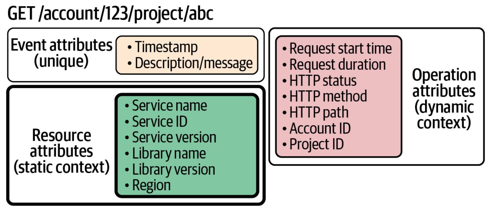

**動態上下文**定義了事件所參與的活動操作。這個操作層面的上下文被稱為**跨度（span）**。每次操作執行時，這些屬性的值都會改變。

不是所有的事件都有兩種類型的上下文。只有資源的自由浮動事件，如程序啟動時發出的事件，被稱為**日誌（log）**。作為分佈式交易的一部分而發生的事件被稱為**跨度事件（span event）**。

## 資源：觀察服務和機器

資源（靜態上下文）描述了一個程序正在進行的物理和虛擬信息結構。服務、容器、部署和區域都是資源。圖 2-2 顯示了一個典型的購物車結賬交易中所涉及的資源。

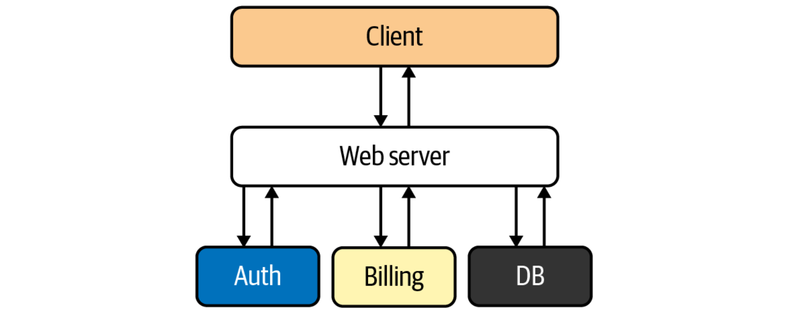

系統運行中的大多數問題都源於資源爭奪，許多並發的交易試圖在同一時間利用相同的資源。通過將事件放在它們所使用的資源的上下文中，就有可能自動檢測出許多類型的資源爭奪。

像事件一樣，資源可以被定義為一組屬性。表 2-2 顯示了一個服務資源的例子。

**表 2-2：服務資源的例子**

| 屬性                | 類型   | 描述                      | 範例                                  |
| ------------------- | ------ | ------------------------- | ------------------------------------- |
| service.name        | string | 服務的邏輯名稱            | shopping cart                         |
| service.instance.id | string | 服務實例的 ID             | 627cc493- f310-47de-96bd-71410b7dec09 |
| service.version     | string | 服務 API 或者實現的版本號  | 2.0.0                                 |

除了識別機器所需的基本信息，配置設置也可以作為資源被記錄下來。要訪問一台正在運行的機器來了解它是如何配置的，這個負擔太讓人害怕了。相反，在配置文件中發現的任何重要信息也應該表示為一種資源。

## 跨度：觀察交易

跨度（動態上下文）描述計算機操作。跨度有一個操作名稱，一個開始時間，一個持續時間，以及一組屬性。

標準操作是使用語義約定來描述的，比如上面描述的 HTTP 約定。但也有一些特定的應用屬性，如 `ProjectID` 和 `AccountID`，可以由應用開發者添加。

跨度也是我們描述因果關係的方式。為了正確記錄整個交易，我們需要知道哪些操作是由其他哪些操作觸發的。為了做到這一點，我們需要給跨度增加三個屬性：`TraceID`、`SpanID` 和 `ParentID`，如表 2-3 所示。

**表 2-3：跨度的三個額外屬性**

| 屬性     | 類型        | 描述         | 範例                             |
| -------- | ----------- | ------------ | -------------------------------- |
| traceid  | 16 字節數組 | 識別整個交易 | 4bf92f3577b34da6a3ce929d0e0e4736 |
| spanid   | 8 字節數組  | 識別當前操作 | 00f067aa0ba902b7                 |
| parentid | 8 字節數組  | 識別父操作   | 53ce929d0e0e4736                 |

這三個屬性是 OpenTelemetry 的基礎。通過添加這些屬性，我們所有的事件現在可以被組織成一個圖，代表它們的因果關係。這個圖現在可以以各種方式進行索引，我們稍後會討論這個問題。

## 追踪：看似日誌，勝過日誌

我們現在已經從簡單的事件變成了組織成與資源相關的操作圖的事件。這種類型的圖被稱為**追踪（trace）**。圖 2-3 顯示了一種常見的可視化追踪方式，重點是識別操作的延遲。

從本質上講，追踪只是用更好的索引來記錄日誌。當你把適當的上下文添加到適當的結構化的日誌中時，可以得到追踪的定義。

想想你花了多少時間和精力通過搜索和過濾來收集這些日誌；那是收集數據的時間，而不是分析數據的時間。而且，你要翻閱的日誌越多，執行並發交易數量不斷增加的機器堆積，就越難收集到真正相關的那一小部分日誌。

然而，如果你有一個 TraceID，收集這些日誌只是一個簡單的查詢。通過 TraceID 索引，你的存儲工具可以自動為你做這項工作；找到一個日誌，你就有了該交易中的所有日誌，不需要額外的工作。

既然如此，為什麼你還會要那些沒有 "追踪"ID 的 "日誌"？我們已經習慣了傳統的日誌管理迫使我們做大量的工作來連接這些點。但這些工作實際上是不必要的；它是我們數據中缺乏結構的副產品。

分佈式追踪不僅僅是一個測量延遲的工具；它是一個定義上下文和因果關係的數據結構。它是把所有東西聯繫在一起的膠水。正如我們將看到的，這種膠水包括最後一個支柱 —— 指標。

## 指標：觀察事件的總體情況

現在我們已經確定了什麼是事件，讓我們來談談事件的聚合。在一個活躍的系統中，同樣的事件會不斷發生，我們以聚合的方式查看它們的屬性來尋找模式。屬性的值可能出現得太頻繁，或者不夠頻繁，在這種情況下，我們要計算這些值出現的頻率。或者該值可能超過某個閾值，在這種情況下，我們想衡量該值是如何隨時間變化的。或者我們可能想以直方圖的形式來觀察數值的分佈。

這些聚合事件被稱為**度量**。就像普通的事件一樣，度量有一組屬性和一組語義上的便利條件來描述普通概念。表 2-4 顯示了一些系統內存的例子屬性。

**表 2-4：系統內存的屬性**

| 屬性                      | 值類型 | 屬性值                    |
| ------------------------- | ------ | ------------------------- |
| system.memory.usage       | int64  | used, free, cached, other |
| system.memory.utilization | double | used, free, cached, other |

## 與事件相關的指標：統一的系統

傳統上，我們認為指標是與日誌完全分開的。但實際上它們是緊密相連的。例如，假設一個 API 有一個衡量每分鐘錯誤數量的指標。那是一個統計數字。然而，每一個錯誤都是由一個特定的交易行為產生的，使用特定的資源。這些細節在我們每次遞增該計數器時都會出現，我們想知道這些細節。

當運維人員被提醒發現錯誤突然激增時，他們會想到的第一個問題自然是："是什麼導致了這個激增？" 看一下例子的追踪可以回答這個問題。在失敗的交易中較早發生的事件（或未能發生的事件）可能是錯誤的來源。

在 OpenTelemetry 中，當指標事件在跨度的範圍內發生時，這些追踪的樣本會自動與指標相關聯，作為**追踪的範例（trace examplar）**。這意味著不需要猜測或尋找日誌。 OpenTelemetry 明確地將追踪和度量聯繫在一起。一個建立在 OpenTelemetry 上的分析工具可以讓你從儀錶盤上直接看到追踪，只需一次點擊。如果有一個模式 —— 例如，一個特定的屬性值與導致一個特定錯誤的追踪密切相關 —— 這個模式可以被自動識別。

## 自動分析和編織

事件、資源、跨度、指標和追踪：這些都被 OpenTelemetry 連接在一個圖中，並且它們都被發送到同一個數據庫，作為一個整體進行分析。這就是下一代的可觀測性工具。

現代可觀測性將建立在使用結構的數據上，這些結構允許分析工具在所有類型的事件和總量之間進行關聯，這些關聯將對我們如何實踐可觀測性產生深遠影響。

向全面觀察我們的系統過渡將有許多好處。但我相信，這些新工具提供的主要省時功能將是各種形式的**自動關聯檢測**。在尋找根本原因時，注意到相關關係可以產生大量的洞察力。如圖 2-4 所示，相關性往往是產生根本原因假設的關鍵因素，然後可以進一步調查。

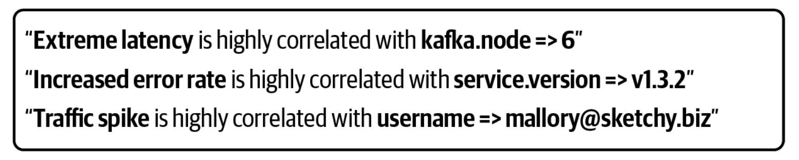

平均表現是什麼樣子的？異常值是什麼樣子的？哪些趨勢在一起變化，它們的共同點是什麼？相關性可能發生在許多地方：跨度中的屬性之間、追踪中的跨度之間、追踪和資源之間、指標內部，以及所有這些地方都有。當所有這些數據被連接到一個圖中時，這些相關性就可以被發現了。

這就是為什麼統一的數據編織是如此關鍵。任何自動匹配的分析的價值完全取決於被分析的數據的結構和質量。機器遍歷數據的圖表；它們不會進行邏輯的飛躍。準確的統計分析需要一個有意設計的遙測系統來支持它。

## 重點：自動分析為您節省時間

為什麼我們關心相關性分析的自動化？因為時間和復雜性對我們不利。隨著系統規模的擴大，它們最終變得太複雜了，任何操作者都無法完全掌握系統的情況，而且在建立一個假設時，永遠沒有足夠的時間來調查每一個可能的聯繫。

問題是，選擇調查什麼需要直覺，而直覺往往需要對組成分佈式系統的每個組件有深刻的了解。隨著企業系統的增長和工程人員的相應增加，任何一個工程師對每個系統深入了解的部分自然會縮減到整個系統的一小部分。直覺並不能很好地擴展。

直覺也極易被誤導；問題經常出現在意想不到的地方。根據定義，可以預見的問題幾乎不會經常發生。剩下的就是所有未曾預料到的問題了，這些問題已經超出了我們的直覺。

這就是自動關聯檢測的作用。有了正確的數據，機器可以更有效地檢測出相關的關聯。這使得運維人員能夠快速行動，反複測試各種假設，直到他們知道足夠的信息來製定解決方案。

# 第 3 章：自動分析的局限性

自動化開始聽起來很神奇，但我們要面對現實：計算機分析不能每天告訴你系統有什麼問題或為你修復它。它只能為你節省時間。

至此，我想停止誇讚，我必須承認自動化的一些局限性。我這樣做是因為圍繞結合人工智能和可觀測性會有相當多的炒作。這種炒作導致了驚人的論斷，大意是："人工智能異常檢測和根源分析可以完全診斷問題！" 和 "人工智能操作將完全管理你的系統！"

## 謹防炒作

為了擺脫此類炒作，我想明確的是，這類夢幻般的營銷主張**並不是**我所宣稱的現代可觀測性將提供的。事實上，我預測許多與人工智能問題解決有關的主張大多是誇大其詞。

為什麼人工智能不能解決我們的問題？一般來說，機器無法識別軟件中的 "問題"，因為定義什麼是 "問題" 需要一種主觀的分析方式。而我們所討論的那種現實世界的人工智能不能以任何程度的準確性進行主觀決策。機器將始終缺乏足夠的背景。

例如，我們說該版本降低了性能，這裡面也隱含了一個期望，就是這個版本包含了每個用戶都期望的新功能。對於這個版本，性能退步是一個特徵，而不是一個錯誤。

雖然它們可能看起來像類似的活動，但在**確定相關關係**和**確定根本原因**之間存在著巨大的鴻溝。當你有正確的數據結構時，相關性是一種**客觀的分析** —— 你只需要計算數字。哪些相關關係是相關的，並表明真正問題的來源，總是需要**主觀的分析，**對數據的解釋。所有這些相關關係意味著什麼？正如杰弗裡・李波斯基（Jeffrey Lebowski）所說："嗯，你知道，這只是你的觀點，伙計。"

## 神奇的 AIOps

在調查一個系統時，有兩種類型的分析起作用：

- 客觀的分析，基於事實的、可衡量的、可觀測的。
- 主觀分析，基於解釋、觀點和判斷的。

這種二分法 —— 客觀與主觀，與可計算性理論中一個重要的問題有關，即**[停機問題（halting problem）](https://en.wikipedia.org/wiki/Halting_problem)**。停機問題的定義是，在給定任意計算機程序及其輸入的描述的情況下，是否可以編寫一個計算機程序來確定任意程序是否會結束運行或永遠繼續運行。簡而言之，在 1936 年，艾倫・圖靈（Alan Turning）證明了解決停機問題的一般算法是不存在的，這個證明的延伸可以應用於計算機軟件中許多形式的識別 "問題"。

阿蘭・圖靈的意思是，我們沒有辦法擁有神奇的 AIOps（IT 運維的人工智能）。尋找那些承諾將繁瑣的客觀分析自動化的工具 —— 計算數字是機器的強項！但要小心那些聲稱能找到問題根源並自動修復的工具。它們很可能會讓你失望。

這就是為什麼我們可以確定相關關係，但不能確定因果關係：想像一下，有一台機器可以確定任意計算機程序中的問題行為是什麼，並確定該行為的根本原因。如果我們真的造出了這樣一台機器，那就是開香檳的時候了，因為這意味著我們終於解決了停機問題！但是，目前還沒有跡象表明，機器可以解決這個問題。然而，沒有跡象表明機器學習已經超越了艾倫・圖靈的統一計算模型；你可以相信，這不會發生。

做出正確的決定和修復的工作還是要靠你自己。

## 時間是最寶貴的資源

然而，我們不需要神奇的 AIOps 來看到我們工作流程的巨大改善。識別相關性，同時獲取相關信息，以便你能有效地瀏覽這些信息，這是計算機**絕對可以**做到的事情！這將為你節省時間。大量的時間。這麼多的時間，它將從根本上改變你調查系統的方式。

減少浪費的時間是實踐現代可觀測性的核心。即使是在簡單的系統中，通過分析數字來識別相關性也是很困難的，而在大規模的系統中，這幾乎是不可能的。通過將認知負擔轉移到機器上，運維人員能夠有效地管理那些已經超出人類頭腦所能容納的系統。

但是，我們分析遙測方式的這種轉變並不是可觀測性世界中即將發生的唯一重大變化。我們需要的大部分遙測數據來自於我們沒有編寫的軟件：我們所依賴的開源庫、數據庫和管理服務。這些系統在傳統上一直在為產生遙測數據而奮鬥。我們可以獲得哪些數據，以及這些數據來自哪裡，也將發生根本性的變化。

# 第 4 章：支持開源和原生監測

到目前為止，我們已經從數據的角度討論了現代可觀測性。但是，現代可觀測性還有另一個方面，從長遠來看，它可能被證明同樣重要：如何對待產生數據的儀表（instrumention）。

大多數軟體系統都是用現成的元件構建的：網絡框架、數據庫、HTTP 客戶端、代理服務器、編程語言。在大多數組織中，很少有這種軟體基礎設施是在內部編寫的。相反，這些組件是在許多組織中共享的。最常見的是，這些共享組件是以開放源碼（OSS）函式庫的形式出現的，並具有許可權。

由於這些開放源碼函式庫幾乎囊括了一般系統中的所有關鍵功能，因此獲得這些庫的高質量說明對大多數可觀測性系統來說至關重要。

傳統上，儀表是 "單獨出售" 的。這意味著，函式庫不包括產生追踪、日誌或度量的儀表。相反，特定解決方案的儀表是在事後添加的，作為部署可觀測系統的一部分。

> **什麼是特定解決方案儀表？ **
>
> 在本章中，術語 "**特定解決方案儀表**" 是指任何旨在與特定的可觀測系統一起工作的儀表，使用的是作為該特定係統的數據存儲系統的產出物而開發的客戶端。在這些系統中，客戶端和存儲系統常常深深地融合在一起。因此，如果一個應用要從一個觀測系統切換到另一個觀測系統，通常需要進行全面的重新佈設。

針對解決方案的儀表是 "三大支柱" 中固有的垂直整合的遺留問題。每個後端都希望取得特定類型的專有數據；因此，這些後端的創建者也必須提供產生這些數據的儀表。

這種工具化的方法給參與軟體開發的每個人都帶來了麻煩：供應商、用戶和開放源碼庫的作者。

## 可觀測性被淹沒在特定解決方案的儀表中

從可觀測性系統的角度來看，儀表化代表了巨大的開銷。

在過去，互聯網應用是相當同質化的，可以圍繞一個特定的網絡框架來建立可觀測性系統。 Java Spring、Ruby on Rails 或 .NET。但隨著時間的推移，軟體的多樣性已經爆炸性增長。現在為每一個流行的網絡框架和數據庫客戶端維護儀表是一項巨大的負擔。

這導致的重複勞動難以估量。傳統上，供應商將他們在儀表上的投資作為銷售點和把關的一種形式。但是，日益增長的軟體開發速度已經開始使這種做法無法維持了。對於一個合理規模的儀表設備團隊來說，覆蓋面實在是太大了，無法跟上。

這種負擔對於新的、新穎的觀測系統，特別是開放源碼軟體的觀測項目來說尤其嚴峻。如果一個新的系統在編寫了大量的儀表之前無法在生產中部署，而一個開放源碼軟體項目在廣泛部署之前也無法吸引開發者的興趣，那麼科學進步就會陷入僵局。這對於基於追踪的系統來說尤其如此，它需要端到端的儀表來提供最大的價值。

## 應用程序被鎖定在特定解決方案的儀表中

從應用開發者的角度來看，特定解決方案的儀表代表了一種有害的鎖定形式。

可觀測性是一個交叉性的問題。要徹底追踪、記錄或度量一個大型的應用程序，意味著成千上萬的儀表 API 調用將遍布整個代碼庫。改變可觀測性系統需要把所有這些工具去掉，用新系統提供的不同工具來代替。

替換儀表是一項重大的前期投資，即使只是為了嘗試一個新的系統。更糟的是，大多數係統都太大了以致於在所有服務中同時更換所有儀表是不可行的。大多數係統需要逐步推出新的儀表設備，但這樣的上線可能很難設計。

被特定解決方案的儀表所 "困住" 是非常令人沮喪的。在可觀測性供應商開始努力提供自己的儀表的同時，用戶也開始拒絕採用這種儀表。由於了解到重新安裝儀表的工作量，許多用戶強烈希望他們正在考慮的任何新的觀測系統能與他們目前使用的儀表一起工作。

為了支持這一要求，許多可觀測性系統試圖與其他幾個系統提供的儀表一起工作。但這種拼湊的方式降低了每個系統所攝取的數據的質量。從許多來源攝取數據意味著對輸入的數據不再有明確的定義，當預期的數據不均衡且定義模糊時，分析工具就很難完成它們的工作。

## 針對開源軟體的特定解決方案的儀表基本上是不可能的

從一個開放源碼庫作者的角度來看，特定解決方案的儀表化是一個悲劇。

來自開放源碼函式庫的遙測數據對於操作建立在它們之上的應用程序來說至關重要。最了解哪些數據對操作至關重要的人，以及操作者應該如何利用這些數據來補救問題的人，就是實際編寫軟件的開源庫的開發者。

但是，函式庫的作者卻陷入了困境。正如我們將看到的，沒有任何一個特定解決方案的儀表化 API，無論寫得多麼好，都無法作為開放源碼庫可以接受的選擇。

## 如何挑選一個日誌庫？

假設你正在編寫世界上最偉大的開源網絡框架。在生產過程中，很多事情都會出錯，你自然希望把錯誤、調試和性能信息傳達給你的用戶。你使用哪個日誌庫？

有很多體面的日誌庫。事實上，有很多，無論你選擇哪個庫，你都會有很多用戶希望你選擇一個不同的庫。如果你的 Web 框架選擇了一個日誌庫，而數據庫客戶端庫選擇了另一個，怎麼辦？如果這兩個都不是用戶想要使用的呢？如果他們選擇了同一個庫的不兼容的版本呢？

沒有一個完美的方法可以將多個特定解決方案的日誌庫組合成一個連貫的系統。雖然日誌足夠簡單，不同解決方案的大雜燴可能是可行的，但對於特定解決方案的指標和追踪來說，情況並非如此。

因此，開放源碼函式庫通常沒有內置的日誌、度量或追踪功能。取而代之的是，庫提供了 "可觀測性鉤子"，這需要用戶編寫和維護一堆適配器，將使用的庫連接到他們的可觀測性系統上。

作者們有大量的知識，他們想通信關於他們的系統應該如何運行的知識，但他們沒有明確的方法去做。如果你問任何寫過大量開源函式的人，他們會告訴你。這種情況是痛苦的！而且是不幸的！一些庫的作者**確實**試圖選擇一個日誌庫，但卻發現他們無意中為一些用戶造成了版本衝突，同時迫使其他用戶編寫日誌適配器來捕捉使用其**實際**日誌庫的數據。

但是對於大多數庫來說，可觀測性只是一個事後的想法。雖然庫的作者經常編寫大量的測試套件，但他們很少花時間去考慮運行時的可觀測性。考慮到庫有大量的測試工具，但可觀測性工具為零，這種結果並不令人驚訝。

正如我們在接下來的幾章中所看到的，現代可觀測性的設計是為了使在可觀測性管道中發揮作用的每個人的代理權最大化。但受益最大的是庫的作者；對於特定解決方案的儀表，他們目前根本沒有選擇。

## 分解問題

我們可以通過設計一個可觀測性系統來解決上面列出的所有問題，以明確地解決每個人的需求。在本章的其餘部分，我們將把現代觀測系統的設計分解為基本要求。這些要求將為第五章中描述的 OpenTelemetry 的結構提供動力

## 要求：獨立的儀表、遙測和分析

歸根結底，計算機系統實際上就是人類系統。像可觀測性這樣的跨領域問題，幾乎與每一個函式庫組件都有互動。同時，傳輸和處理遙測數據可能是一個大批量的活動，以至於一個大規模的觀測系統會產生自己的操作問題。這意味著，許多不同的人，以不同的身份，需要與觀測系統的不同方面交互。為了很好地服務於他們，這個系統必須確保每個參與其中的人都有他們所需要的代理權，以便快速和獨立地執行任務。提供代理權是設計一個有效的觀測系統的基本要求。

讓我們首先確定與運行中的軟體系統有關的每個角色的責任：庫的作者、應用程序的所有者、操作者和響應者。

**函式庫的作者了解他們軟體的情況**

對於封裝了關鍵功能的軟體庫，如網絡和請求管理，庫的作者也必須管理追踪系統的各個方面：注入、提取和上下文傳播。

**應用程序擁有者組織軟體並管理依賴關係**

應用程序所有者選擇構成其應用程序的組件，並確保它們編譯成一個連貫的、有功能的系統。應用程序所有者還編寫應用程序級別的工具，它必須與庫作者提供的指令（和上下文傳播）進行正確的交互。

**運維人員管理遙測的生產和傳輸**

運維管理從應用到響應者的可觀測性數據的傳輸。他們必須能夠選擇數據的格式以及數據的發送地點。當數據在產生時，他們必須操作傳輸系統：管理緩衝、處理和傳送數據所需的所有資源。

**響應者消費遙測數據並產生有用的見解**

要做到這一點，應對者必須了解數據結構及其內在意義（結構和意義將在第三章中詳細描述）。當新的和改進的分析工具出現時，反應者還需要將其添加到他們的工具箱中。

這些角色代表不同的決策點：

- 庫的作者只能通過發布其代碼的新版本來進行修改。
- 應用程序所有者只能通過部署其可執行文件的新版本來進行更改。
- 運維人員只能通過管理可執行文件的拓撲結構和配置來進行改變。
- 響應者只能根據他們收到的數據做出改變。

傳統的三大支柱方法擾亂了所有這些角色。垂直整合的一個副作用是，幾乎所有的數據變化都需要進行代碼修改。幾乎任何對可觀測性系統的非微不足道的改變都需要應用程序所有者進行代碼修改。要求其他人進行你所關心的改變，這樣會有很大的阻力，並可能導致壓力、衝突和不作為。

顯然，一個設計良好的可觀測性系統應該側重於允許每個人盡可能多的代理和直接控制，它應該避免將開發者變成意外的看門人。

## 要求：零依賴性

應用程序是由依賴關係（網絡框架、數據庫客戶端），加上依賴關係的依賴關係（OpenTelemetry 或其他儀表庫），加上它們的依賴關係的依賴關係的依賴關係（無論這些儀表庫依賴什麼）組成。這些都被稱為反式的依賴關係。

如果任何兩個依賴關係之間有衝突，應用程序就無法運行。例如，兩個庫可能分別需要一個不同的（不兼容的）底層網絡庫的版本，如 gRPC。這可能會導致一些不好的情況。例如，一個新版本的庫可能包括一個需要的安全補丁，但也包括一個升級的依賴關係，這就產生了依賴關係衝突。

諸如此類的過渡性依賴衝突給應用程序所有者帶來了很大的麻煩，因為這些衝突無法獨立解決。相反，應用程序所有者必須聯繫庫的作者，要求他們提供一個解決方案，這最終需要時間（假設庫的作者回應了這個請求）。

為了使現代可觀測性發揮作用，函式庫必須能夠嵌入儀表，而不必擔心當他們的庫被用於組成應用程序時而導致問題。因此，可觀測性系統必須提供不包含可能無意中引發橫向依賴衝突的依賴性的儀表。

## 要求：嚴格的後向兼容和長期支持

當一個儀表化的 API 破壞了向後的兼容性，壞事就會發生。一個精心設計的應用程序最終可能會有成千上萬的儀表調用站點。由於 API 的改變而不得不更新數以千計的調用站點是一個相當大的工作量。

這就產生了一種特別糟糕的依賴性衝突，即一個庫中的儀表化不再與另一個庫中的儀表化兼容。

因此，儀表化 API 必須在很長的時間範圍內具有嚴格的向後兼容能力。理想的情況是，儀表化 API 一旦變得穩定，就永遠不會破壞向後兼容。新的、實驗性的 API 功能的開發方式必須保證它們的存在不會在包含穩定儀表的庫之間產生衝突。

## 分離關注點是良好設計的基礎

在下一章中，我們將深入研究 OpenTelemetry 的架構，看看它是如何滿足上面提出的要求的。但在這之前，我想說的是一個重要的問題。

如果你分析這些需求，你可能會注意到一些奇特的現象：它們中幾乎沒有任何專門針對可觀測性的內容。相反，重點是盡量減少依賴性，保持向後的兼容性，並確保不同的用戶可以在沒有無謂干擾的情況下發揮作用。

每一個要求都指出了關注點分離是一個關鍵的設計特徵。但是這些特性並不是 OpenTelemetry 所獨有的。任何尋求廣泛採用的函式庫都會很好地包括它們。在這個意義上，OpenTelemetry 的設計也可以作為設計一般的開源軟體的指南。下次當你開始一個新的開放源碼函式庫項目時，請預先考慮這些要求，相應地設計你的庫及你的用戶會感謝你的。

# 第 5 章：OpenTelemetry 架構概述

第 2 章描述了實現自動分析所需的數據模型，第 4 章描述了支持原生開源儀表的額外要求，並賦予各角色（應用程序所有者、運維和響應者）自主權。這就是我們對現代可觀測性的概念模型。

在本報告的其餘部分，我們描述了這個新模型的一個事實實現，即 OpenTelemetry。這一章描述了構成 OpenTelemetry 遙測管道的所有組件。後面的章節將描述穩定性保證、建議的設置以及 OpenTelemetry 現實中的部署策略。有關該項目的更多細節可以在附錄中找到。

## 信號

OpenTelemetry 規範被組織成不同類型的遙測，我們稱之為**信號（signal）**。主要的信號是追踪。日誌和度量是其他例子。信號是 OpenTelemetry 中最基本的設計單位。

每一個額外的信號首先是獨立開發的，然後與追踪和其他相關信號整合。這種分離允許開發新的、實驗性的信號，而不影響已經變得穩定的信號的兼容性保證。

OpenTelemetry 是一個**跨領域的關注點（cross-cutting concern）**，它在事務通過每個庫和服務時追踪其執行。為了達到這個目的，所有的信號都建立在低級別的上下文傳播系統之上，該系統為信號提供了一個地方來存儲它們需要與當前正在執行的代碼相關聯的任何事務級數據。因為上下文傳播系統與追踪系統是完全分開的，其他跨領域的問題也可以利用它。圖 5-1 說明了這個分層結構。

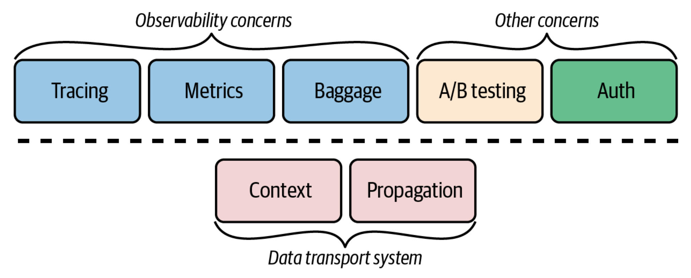

## 上下文（Context）

上下文對像是一個與執行上下文相關聯的鍵值存儲，例如線程或循環程序。如何實現這一點取決於語言，但 OpenTelemetry 在每種語言中都提供一個上下文對象。

信號在上下文對像中存儲它們的數據。因為 OpenTelemetry 的 API 調用總是可以訪問整個上下文對象，所以信號有可能成為集成的，並在上下文共享數據，而不需要改變 API。例如，如果追踪和度量信號都被啟用，記錄一個度量可以自動創建一個追踪範例。日誌也是如此：如果有的話，日誌會自動綁定到當前的追踪。

## 傳播器（Propagator）

為了使分佈式追踪發揮作用，追踪上下文必須被參與事務的每個服務所共享。傳播器通過序列化和反序列化上下文對象來實現這一點，允許信號在網絡工作請求中追踪其事務。

## 追踪（Tracing）

OpenTelemetry 追踪系統是基於 OpenTracing 和 OpenCensus。這兩個系統，以及流行的 Zipkin 和 Jaeger 項目，都是基於谷歌開發的 Dapper 追踪系統。 OpenTelemetry 試圖與所有這些基於 Dapper 的系統兼容。

OpenTelemetry 追踪包括一個叫做**鏈接（link）**的概念，它允許單獨的追踪被組合成一個更大的圖。這被用來連接事務和後台處理，以及觀察大型異步系統，如 Kafka 和 AMQP。

## 指標（Metric）

度量指標（metric）是一個很大的話題，包含各種各樣的方法和實現。 OpenTelemetry 度量信號被設計成與 Prometheus 和 StatsD 完全兼容。

指標包括追踪樣本，自動將指標與產生它們的追踪樣本聯繫起來。手工將指標和追踪聯繫起來往往是一項繁瑣且容易出錯的任務，自動執行這項任務將為運維人員節省大量的時間。

## 日誌（Log）

OpenTelemetry 結合了高度結構化的日誌 API 和高速日誌處理系統。現有的日誌 API 可以連接到 OpenTelemetry，避免了對應用程序的重新測量。

每當它出現的時候，日誌就會自動附加到當前的追踪中。這使得事務日誌很容易找到，並允許自動分析，以找到同一追踪中的日誌之間的準確關聯。

## Baggage

OpenTelemetry Baggage 是一個簡單但通用的鍵值系統。一旦數據被添加為 Baggage（包袱）它就可以被所有下游服務訪問。這允許有用的信息，如賬戶和項目 ID，在事務的後期變得可用，而不需要從數據庫中重新獲取它們。例如，一個使用項目 ID 作為索引的前端服務可以將其作為 Baggage 添加，允許後端服務也通過項目 ID 對其跨度和指標進行索引。

你可以將 Baggage 看做是一種**分佈式文本的**形式。直接放入上下文對象的項目只能在當前服務中訪問。與追踪上下文一樣，作為 Baggage 添加的項目被作為 header 注入網絡請求，允許下游服務提取它們。

與上下文對像一樣，Baggage 本身不是一個可觀測性工具。它更像是一個通用的數據存儲和傳輸系統。除了可觀測性之外，其他跨領域的工具，例如，功能標記、A/B 測試和認證，可以使用 Baggage 來存儲他們需要追踪當前事務的任何狀態。

然而，Baggage 是有代價的。因為每增加一個項目都必須被編碼為一個頭，每增加一個項目都會增加事務中每一個後續網絡請求的大小。這就是為什麼我們稱它為 Baggage。我建議，Baggage 要少用，作為交叉關注的一部分。 Baggage 不應該被用作明確定義的服務 API 的 "方便" 替代品，以明確地向下游應用程序發送參數。

## OpenTelemetry 客戶端架構

應用程序通過安裝一系列的軟件庫來檢測 OpenTelemetry：API、SDK（軟件開發工具包）、SDK 插件和庫檢測。這套庫被稱為 OpenTelemetry 客戶端。圖 5-2 顯示了這些組件之間的關係。

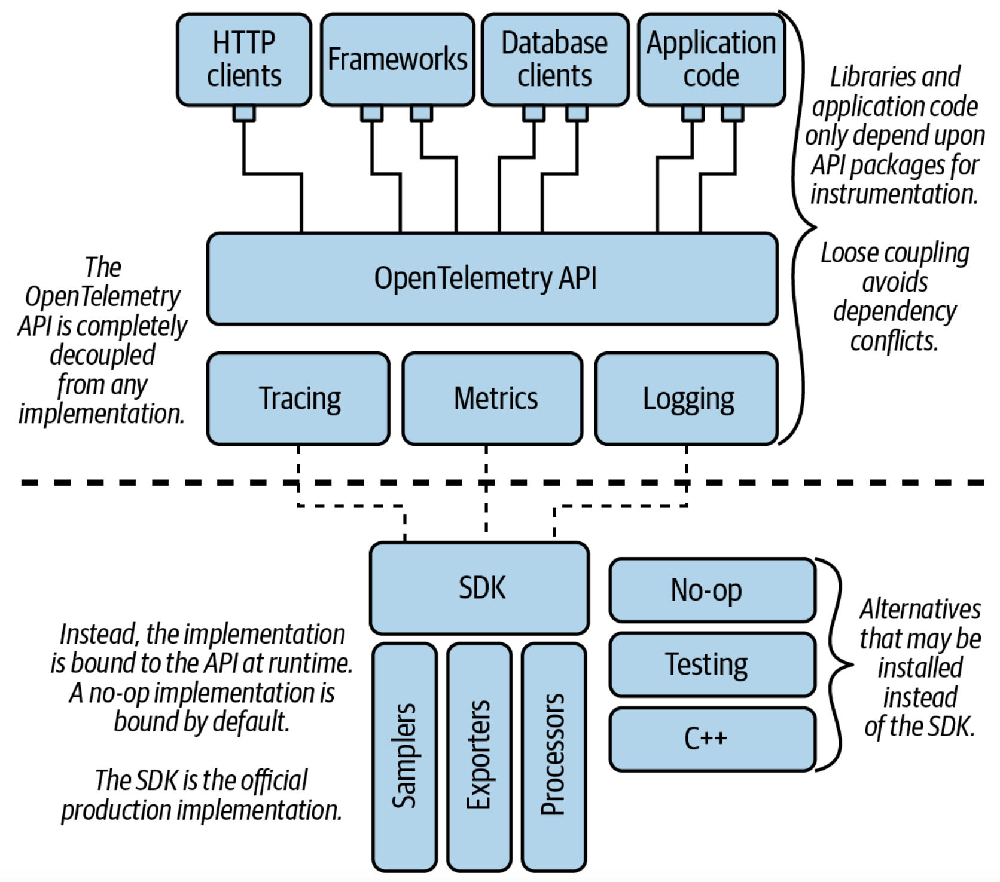

在許多語言中，OpenTelemetry 提供安裝程序，這有助於自動安裝和設置 OpenTelemetry 客戶端。然而，可用的自動化程度取決於語言。在 Java 中，OpenTelemetry 提供了一個 Java 代理，它通過動態地註入所有必要的組件來實現安裝的完全自動化。在 Go 中，OpenTelemetry 包必須通過編寫代碼來安裝和初始化，就像任何其他 Go 包一樣。 Python、Ruby 和 NodeJS 介於兩者之間，提供不同程度的自動化。

在學習 OpenTelemetry 時，了解在你使用的語言中如何設置是很重要的。特別是，一定要學習如何安裝儀表，因為不同的語言有很大的不同。

請查看[客戶端文檔](https://opentelemetry.io/docs/)，了解更多的入門細節。

## 客戶端架構：儀表 API

**OpenTelemetry API** 是指用於編寫儀表的一組組件。該 API 被設計成可以直接嵌入到開放源碼軟件庫以及應用程序中。這是 OpenTelemetry 的唯一部分，共享庫和應用邏輯應該直接依賴它。

## 提供者（Provider）

API 與任何實現完全分開。當一個應用程序啟動時，可以通過為每個信號註冊一個提供者來加載一個實現。提供者成為所有 API 調用的接收者。

當沒有加載提供者時，API 默認為無操作提供者。這使得 OpenTelemetry 儀表化可以安全地包含在共享庫中。如果應用程序不使用 OpenTelemetry，API 調用就會變成 no-ops，不會產生任何開銷。

對於生產使用，我們建議使用官方的 OpenTelemetry 提供商，我們稱之為 **OpenTelemetry SDK**。

> **為什麼有多個實現方案？**
>
> API 和實現的分離有很多好處。但是，如果用戶被迫總是安裝官方的 OpenTelemetry SDK，這又有什麼意義？是否有必要安裝另一個實現？ SDK 已經具有很強的擴展性。
>
> 我們相信是有的。雖然我們希望 OpenTelemetry 儀表是通用的，但建立一個對所有用例都理想的單一實現是不可能的。儘管我們相信 OpenTelemetry SDK 很好，但也應該有一個選擇，那就是使用另一種實現。實現的靈活性是提供通用儀表 API 的一個關鍵特徵。
>
> 
首先，這種分離保證了 OpenTelemetry 不會產生無法克服的依賴衝突。我們總是可以選擇加載一個包括不同依賴鏈的實現。
>
> 另一個原因是性能。 OpenTelemetry SDK 是一個可擴展的、通用的框架。雖然 SDK 的設計是為了盡可能地提高性能，但擴展性和性能總是要權衡一下的。例如，通過外來函數接口創建與 OpenTelemetry C++ SDK 的綁定，有可能成為 Ruby、Python 和 Node.js 等動態腳本語言的一個非常有效的選擇。

還有一些流媒體架構顯示了有希望的性能提升。在許多這樣的優化解決方案中，編寫插件和生命週期鉤子的能力將受到嚴重限制；支持這些類型的功能所需的數據結構在這些優化解決方案中是不存在的。規根究柢，沒有 "完美的實現"；只有權衡。

API/SDK 的分離是一個關鍵的設計選擇，該項目大量使用了這一點。例如，除了 SDK 之外，每一種語言都有一個 no-op 的實現，它是默認安裝的。還有一個 Fake/Mock 實現，我們用它來測試。而且，還有可能實現更多創造性的實現。例如，為分佈式系統建立開發者工具，如一個實時調試器，它可以跨越網絡邊界工作。
## 客户端架构：SDK

OpenTelemetry 項目為 OpenTelemetry API 提供了一個官方實現，我們稱之為 OpenTelemetry SDK。該 SDK 通過提供一個插件框架來實現 OpenTelemetry API。下面將介紹追踪 SDK；類似的架構也適用於度量和日誌。

基本數據結構是一個無鎖的 SpanData 對象。當用戶開始一個跨度時，SpanData 對像被創建，當用戶添加屬性和事件時，它被自動建立起來。一旦一個跨度結束，SpanData 對象將不再被更新，可以安全地傳遞給後台線程。

SDK 的插件架構被組織成一個流水線。對於追踪來說，該管道由一連串的 SpanProcessors 組成。每個處理器對 SpanData 對象進行兩次同步訪問：一次是在跨度開始時，另一次是在跨度結束後。採樣器、日誌附加器和數據清洗器是 SpanProcessors 的例子。鏈中的最後一個處理器通常是一個 BatchSpanProcessor，它管理著一個已完成的跨度的緩衝區。輸出器可以連接到 BatchSpanProcessor，通過網絡將成批的跨度傳遞到遙測管道中的下一個服務，通常將它們發送到收集器或直接發送到追踪後端。一旦跨度被導出，管道就完成了，SpanData 對像也被釋放。

## 採樣器（Sampler）

OpenTelemetry 提供了幾種常見的採樣算法，包括前期採樣和基於優先級的採樣。採樣可以幫助控製成本，但它是有代價的：你將會錯過數據。在啟用任何種類的採樣算法之前，重要的是要檢查你計劃使用的分析工具支持哪些類型的採用。意外的採樣可能會破壞某些形式的分析。一些工具需要他們自己的採樣插件。例如，AWS X-Ray 使用它自己的採樣算法，它可以作為 AWS 特定的採樣插件使用。

## 導出器（Exporter）

OpenTelemetry 為 OTLP（OpenTelemetry Protocol）、Jaeger、Zipkin、Prometheus 和 StatsD 提供導出器。由第三方維護的其他導出器可以在每種語言的 OpenTelemetry-Contrib 資源庫中找到。使用 [OpenTelemetry 註冊表](https://opentelemetry.io/registry/)來了解目前有哪些插件可用。

## 客戶端架構：庫儀表化

為了正常工作，OpenTelemetry 需要端到端的工具。這不是可有可無的：如果關鍵的庫不包括儀表，上下文傳播將被破壞。

一般來說，必須檢測的庫包括 HTTP 客戶端、HTTP 服務器、應用框架、消息傳遞 / 隊列系統和數據庫客戶端。這些庫經常在上下文傳播中起作用。

- HTTP 客戶端必須創建一個**客戶端 span** 來記錄請求。客戶端還必須使用一個傳播器，將當前的上下文作為一組 HTTP 頭信息注入到請求中。
- HTTP 服務器（應用框架）必須使用一個傳播器來從 HTTP 頭信息中提取上下文。提取的上下文被用來創建一個**服務器跨度**，該跨度被設置為當前活動的跨度，它封裝了所有的應用程序代碼。
- 同樣，消息 / 隊列系統中的發送者必須使用傳播器將上下文注入消息中，這樣就可以通過在接收者身上提取上下文來繼續追踪。
- 數據庫客戶必須創建一個**數據庫跨度**來記錄數據基礎事務。一旦數據庫服務器也使用 OpenTelemetry 工具，數據庫客戶端也必須將上下文注入數據庫請求中。

這一要求是我們希望看到開放源碼函式庫能帶有本地儀表的主要原因之一。同時，儀表插件是由 OpenTelemetry 項目或第三方提供的 **contrib 包。**

## 收集器（Collector）

除了上述的客戶端外，OpenTelemetry 還提供了一個獨立的服務，稱為收集器。收集器是一個靈活、可配置的遙測處理系統。其基本結構如圖 5-3 所示。

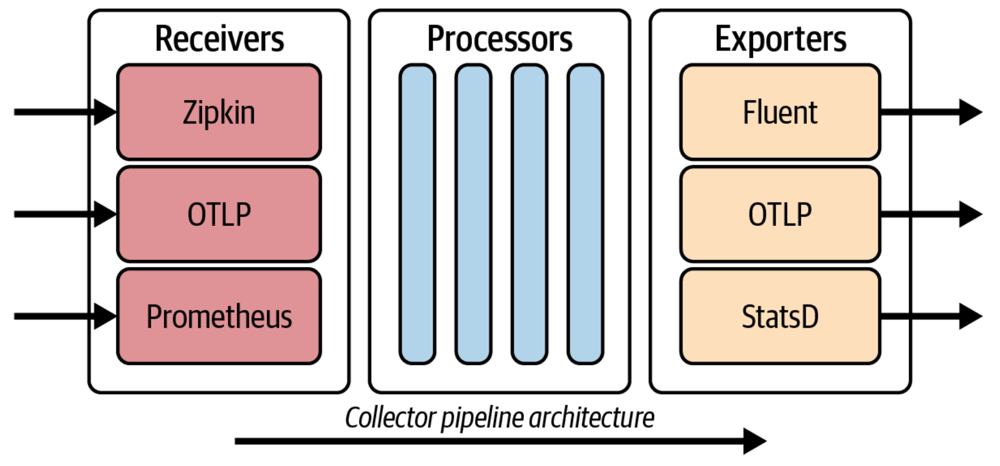

收集器管道可以提供以下服務：

- 配置，如路由和數據導出格式。 OpenTelemetry 客戶端可用的幾乎所有配置選項都可以在收集器中進行管理。
- 數據處理，如刷新、格式轉換和向多個目的地發送。
- 緩衝，幫助管理網絡。
- 機器級環境的資源檢測。可以發現主機、Kubernetes 和雲提供商的細節，並將其附加到收集器收到的所有數據上。
- 收集主機指標，如 RAM、CPU 和存儲容量。

運維人員可以使用收集器來管理與可觀測系統相關的所有部署細節，而不需要與應用程式本身進行交互。由於大多數配置選項是特定於部署的，而且是由運維而不是應用程序開發人員管理的，因此，將遙測配置從應用程序轉移到收集器，可以乾淨地分離關注點。

如果所有的路由和數據處理任務都轉移到收集器上，OpenTelemetry SDK 就可以以更簡單的配置運行。默認情況下，SDK 將發送未處理的 OTLP 數據到一個預定的本地端口，在那裡它可以由本地收集器接收。

## 收集器架構：接收器（Receiver）

收集器可以被配置為從各種來源接收各種格式的遙測數據。目前，收集器支持超過四十種不同類型的接收器！一旦接收到，所有這些數據都會被轉換為 OTLP。 OpenTelemetry 同時支持基於推和拉的接收器。

## 收集器架構：處理器（Processor）

一旦接收器將遙測數據轉換為 OTLP，就會有各種處理器可用。處理器可以被配置為執行各種任務。

- 清洗數據以刪除敏感數據，如 PII（個人身份信息）。
- 數據規範化，例如將數據源的舊版本轉換為與當前後台使用的儀錶盤和查詢相匹配的版本。
- 根據某些屬性將數據路由到特定的後端。例如，將與歐盟用戶有關的數據存儲在歐盟境內託管的存儲系統上。
- 基於尾部的採樣，以幫助確保錯誤和異常值更有可能被捕獲，同時對嘈雜和無趣的信息進行速率限制。

## 收集器架構：導出器（Exporter）

一旦遙測數據被處理，它可以被輸出到各種後端。在未來，我們希望越來越多的後端能夠原生支持 OTLP。同時，OTLP 可以被轉換為目前流行的系統所支持的許多格式。請查看 [OpenTelemetry 供應商頁面](https://opentelemetry.io/vendors/)，找到目前支持 OpenTelemetry 的商業供應商列表。

除了將遙測數據轉換為單一格式外，還可以安裝多個導出器。遙測數據可以按類型分開，並發送到不同的後端。例如，將追踪數據發送到 Jaeger，將度量數據發送到 Prometheus。

重複的遙測數據也可以被同步發送到多個後端。這使得運維人員可以從一個後端無縫切換到另一個後端，而不會有任何服務上的損失。它還允許特殊的分析工具與通用的觀測平台一起接收數據。

## 收集器架構：管道（Pipeline）

收集器允許接收器、處理器和導出器組合成複雜的管道（pipeline），可以同時運行。管道是通過 YAML 配置文件設計和管理的。

這種配置語言是非常強大的。通過在每台機器上部署一個本地收集器，並將它們連接到配置為執行專門處理任務的幾層收集器部署上，收集器可以用來開發一個大規模的、強大的遙測系統。

# 第 6 章：穩定和長期支持

OpenTelemetry 被設計成允許長期穩定性和不確定性並存的局面。在 OpenTelemetry 中，穩定性保證是在每個信號的基礎上提供的。與其看版本號，不如檢查你想使用的信號的穩定性等級。

## 信號生命週期

圖 6-1 顯示了新信號是如何被添加到 OpenTelemetry 的。 **實驗性**信號仍在開發中。它們可能在任何時候改變並破壞兼容性。實驗性信號的開發是以規範提案的形式開始的，它是與一組原型一起開發的。一旦實驗性信號准備好在生產中使用，信號的特性就會被凍結，新信號的測試版就會以多種語言創建。測試版可能不是完整的功能，它們可能會有一些突破性的變化，但它們被認為是為早期採用者的產品反饋做好準備。一旦一個信號被認為可以被宣佈為**穩定**版本，就會發布一個候選版本。如果候選版本能夠在一段時間內保持穩定，沒有問題，那麼該信號的規範和測試版都被宣佈為穩定。

一旦一個信號變得穩定，它就屬於 OpenTelemetry 的長期支持保障範圍。 OpenTelemetry 非常重視向後兼容和無縫升級。詳情見以下章節。

如果 OpenTelemetry 信號的某個組件需要退役，該組件將被標記為**廢棄的**。被廢棄的組件不再獲得新的功能，但它們仍然被 OpenTelemetry 的長期支持保證所覆蓋。如果可能的話，該組件將永遠不會被刪除，並將繼續發揮作用。如果一個組件必須被刪除，將提前宣布刪除日期。

實驗性的功能總是與穩定性的功能保持在不同的包中，穩定的功能永遠不能引用實驗性的功能。這確保了新的開發不會影響現有特性的穩定性。只要函式庫只依賴於穩定的特性，它們就不會經歷破壞性的 API 變化。

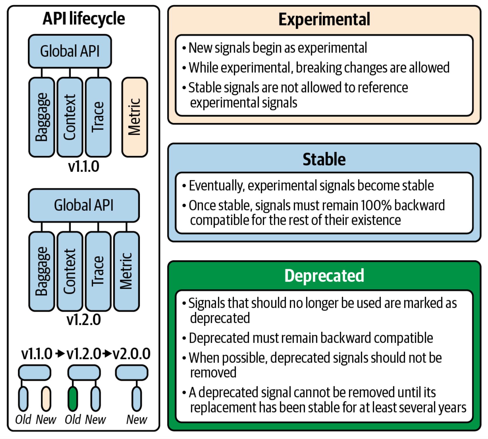

## API 的穩定性

OpenTelemetry API 預計將被數以千計的庫所依賴，有數以百萬計的調用站點。因此，API 的穩定部分決不能破壞向後的兼容性。應用程序的所有者和庫的開發者不應該為了升級到一個新版本的 API 而重新測量他們的應用程序。

如果一個 OpenTelemetry API 被廢棄（這不太可能），被廢棄的 API 仍將保持穩定並發揮功能。

> **原生工具是穩定的工具**
>
> 攜帶原生 OpenTelemetry 儀表的 OSS 庫應該只使用穩定的 API，因為實驗性功能的改變可能會造成依賴性衝突。
>
> 也就是說，我們鼓勵進行測試。如果一個函式庫願意為實驗性的 OpenTelemetry 功能提供支持，這是一個給項目提供反饋和參與新功能設計的好方法。然而，我們建議將與實驗性 OpenTelemetry 功能的集成作為可選的插件提供，終端用戶必須單獨安裝才能啟用。
>
> 一旦功能變得穩定，就沒有必要把它們作為一個單獨的插件。事實上，最好是將 OpenTelemetry 原生集成，因為用戶可能會忘記安裝插件。這樣一來，如果應用程序所有者安裝了 OpenTelemetry SDK，他們就會自動開始接收來自每個庫的數據。如果沒有安裝 SDK，API 的調用就沒有意義了。原生儀表是我們希望 OpenTelemetry 能夠簡化應用程序所有者的觀察能力的一種方式 —— 它已經存在於每一個庫中，只要它需要，就可以隨時使用。

## SDK 和收集器的穩定性

SDK 的穩定性集中在兩個方面：插件接口和資源使用。 SDK 可能偶爾會廢止一個插件接口。為了確保應用程序的所有者能夠乾淨利落地進行升級，必須在廢棄的接口被刪除之前添加一個替代接口，而使用廢棄接口的流行插件必須被遷移到新的接口上。通過以這種方式安全地遷移插件生態系統，可以避免應用程序所有者陷入這樣的境地：他們想要升級，但卻被一個無法使用的插件所阻擋。在廢棄和移除一個插件接口之間必須有至少 6 個月的時間，而且廢棄的接口只有在維護它們會造成性能問題時才會被移除。否則，我們將無限期地保留這些被廢棄的接口。

說到性能，OpenTelemetry SDK 的穩定部分必須避免性能倒退，以確保 SDK 的較新版本在升級時不會引起資源爭奪。很明顯，啟用新版本中增加的功能可能需要額外的資源。但是，簡單地升級 SDK 不應該導致性能退步。

與 SDK 一樣，收集器試圖避免性能退步，並為收集器插件生態系統提供一個漸進的升級路徑。

## 升級 OpenTelemetry 客戶端

在運行 OpenTelemetry 時，我們希望用戶能保持最新的 SDK 版本。有兩個事件可能會迫使用戶升級 SDK：一個庫將其儀表升級到新版本的 API，或者 OpenTelemetry 發布一個重要的安全補丁。

上面列出的穩定性保證確保了這種升級路徑始終是可行的。只要一個應用程序只依賴於穩定的信號，升級應該只涉及依賴性的提升。教程不需要重寫，插件也不會突然變得不受支持。

OpenTelemetry 致力於向後兼容的一個很好的例子是它對其前身 OpenTracing 的支持。 OpenTelemetry 追踪信號與 OpenTracing API 完全兼容，OpenTelemetry 和 OpenTracing API 調用可以混合到同一個應用程序中。 OpenTracing 用戶可以升級到 OpenTelemetry 而不需要重寫現有的儀表。

# 第 7 章：建議的設置和遙測管道

現在我們了解了組成 OpenTelemetry 的各個構件，我們應該如何將它們組合成一個強大的生產管道？

答案取決於你的出發點是什麼。 OpenTelemetry 是模塊化的，設計成可以在各種不同的規模下工作。你只需要使用相關的部分。這就是說，我們已經創建了一個建議的路線圖供你遵循。

## 安裝 OpenTelemetry 客戶端

可以單獨使用 OpenTelemetry 客戶端而不部署收集器。這種基本設置通常是綠地部署的充分起點，無論是測試還是初始生產。 OpenTelemetry SDK 可以被配置為直接向大多數可觀測性服務傳輸遙測數據。

## 挑選一個導出器

默認情況下，OpenTelemetry 使用 OTLP 導出數據。該 SDK 提供了幾種常見格式的導出器。 Zipkin、Prometheus、StatsD 等。如果你使用的可觀測性後端沒有原生支持 OTLP，那麼這些其他格式中的一種很可能會被支持。安裝正確的導出器並將數據直接發送到你的後端系統。

## 安裝庫儀表

除了 SDK，OpenTelemetry 儀表必須安裝在所有 HTTP 客戶端、Web 框架、數據庫和應用程序的消息隊列中。如果這些庫中有一個缺少儀表，上下文傳播就會中斷，導致不完整的追踪和混亂的數據。

在某些語言中，如 Java，儀表可以自動安裝，這就更容易了。請確保了解 OpenTelemetry 如何在你使用的編程語言中管理儀表，並仔細檢查儀表是否正確安裝在你的應用程序中。

## 選擇傳播器

仔細檢查你的系統需要哪些傳播器也很重要。默認情況下，OpenTelemetry 使用 W3C 的追踪上下文和 Baggage 傳播器。然而，如果你的應用程序需要與使用不同的追踪傳播器的服務進行通信，如 Zipkin 的 B3 或 AWS 的 X-Amzn，那麼改變 `OTEL_PROPAGATORS` 配置以包括這個額外的傳播器。

如果 OpenTelemetry 最終要取代這些其他的追踪系統，我建議同時運行 trace-context 和額外的追踪傳播器。這將使你在部署中逐步取代舊系統時，能夠無縫地過渡到 W3C 標準。

## 部署本地收集器

雖然有些系統有可能只使用客戶端，但通過在你的應用程序所運行的機器上添加一個本地收集器，可以改善你的操作體驗。

運行一個本地收集器有許多好處，如圖 7-1 所示。收集器可以生成機器指標（CPU、RAM 等），這是遙測的一個重要部分。收集器還可以完成任何需要的數據處理任務，如從追踪和日誌數據中清除 PII。

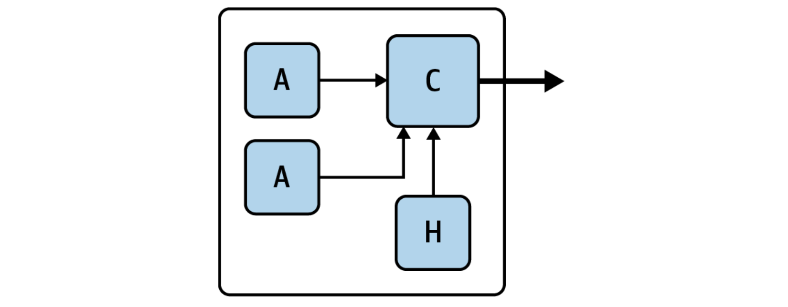

運行收集器後就可以將大多數遙測配置從你的應用程序中移出。遙測配置通常是特定的部署，而不是特定的應用。 SDK 可以簡單地設置為使用默認配置，總是將 OTLP 數據導出到預定義的本地端口。通過管理本地收集器，運維可以在不需要與應用程序開發人員協調或重新啟動應用程序的情況下進行配置更改。在通過複雜的 CI/CD（持續集成 / 持續交付）管道移動應用程序時，這尤其有幫助，因為在不同的暫存和負載測試環境中，遙測需要不同的處理方式。

快速發送遙測數據到本地收集器，可以作為一個緩衝器來處理負載，並確保在應用程序崩潰時，緩衝的遙測數據不會丟失。

## 部署收集器處理器池

如果你的本地收集器開始執行大量的緩沖和數據處理，它就會從你的應用程序中竊取資源。這可以通過部署一個只運行收集器的機器池來解決，這些機器位於負載均衡器後面，如圖 7-2 所示。現在可以根據數據吞吐量來管理收集器池的大小。

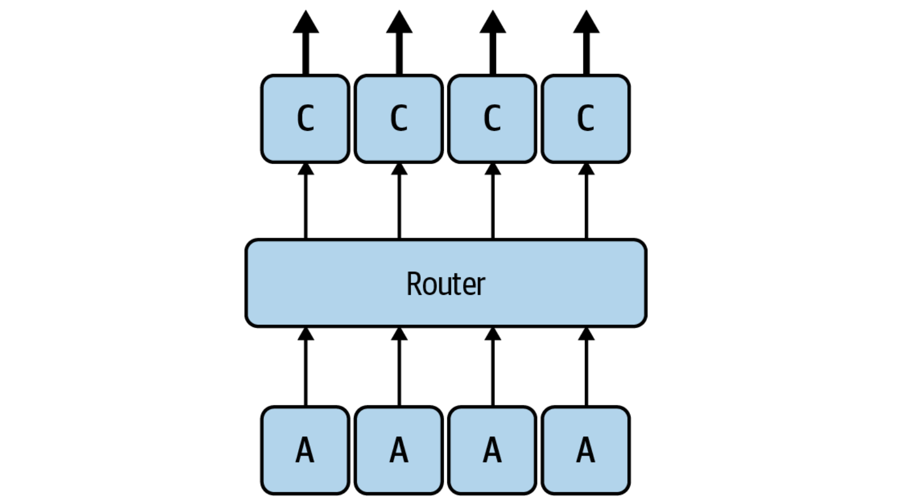

本地收集器現在可以關閉其處理器以釋放資源。它們繼續收集機器級遙測數據，作為來自本地應用程序的 OTLP 的轉發機制。

## 添加額外的處理池

有時，單個收集器池是不夠的。一些任務可能需要以不同的速度擴展。將收集器池分割成一個更專門的池的管道，可能允許更有效和可管理的擴展策略，因為每個專門的收集器池的工作負載變得更可預測。

一旦你達到了這個規模，就沒有什麼部署的問題了。大規模系統的專門需求往往是獨特的，這些需求將驅動你的可觀測性管道的拓撲結構。利用收集器提供的靈活性，根據你的需求來定制每一件事情。我建議對每個收集器配置的資源消耗進行基準測試，並使用這些信息來創建彈性的、自動擴展的收集器池。

## 用收集器管理現有的遙測數據

上面描述的路線圖適用於上線 OpenTelemetry。但你應該如何處理現有的遙測？大多數運行中的系統已經有了某種形式的指標、日誌和（可能有）追踪。而大型的、長期運行的系統往往最終會有多個遙測解決方案的補丁。不同的組件可能是在不同的時代建立的，有些組件可能是從外部繼承的，比如收購。從可觀測性的角度來看，這可能會導致混亂的局面。

即使在這樣複雜的遺留情況下，仍然有可能過渡到 OpenTelemetry，而不需要停機或一次重寫所有的服務。秘訣是首先部署一個收集器，作為一個透明的代理。

在收集器中，為接收你的系統目前產生的每一種類型的遙測設置接收器，並與以完全相同的格式發送遙測的導出器相連。一個 StatsD 接收器連接到一個 StatsD 導出器，一個 Zipkin 接收器連接到一個 Zipkin 導出器，以此類推。這種透明的代理可以逐步推出，而不會造成干擾。一旦所有的遠程測量都由這些收集器來調解，就可以引入額外的處理。甚至在你把你的儀表切換到 OpenTelemetry 之前，你可能會發現這些收集器是管理和組織你當前拼湊的遙測系統的一個有用的方法。圖 7-3 顯示了一個收集器處理來自各種來源的數據。

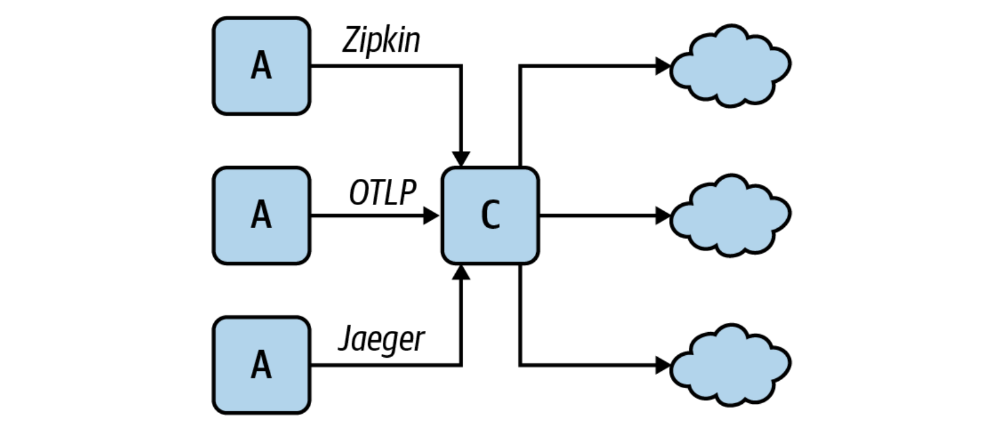

為了開始將服務切換到 OpenTelemetry，可以在收集器上添加一個 OTLP 接收器，與現有的導出器相連。隨著服務轉向使用 OpenTelemetry 客戶端，它們將 OTLP 發送到收集器，收集器將把 OTLP 翻譯成這些系統以前產生的相同數據。這使得 OpenTelemetry 可以由不同的應用團隊逐步上線，而不會出現中斷。

## 轉移供應商

一旦所有的遙測流量都通過收集器發送，切換到一個新的可觀測性後端就變得很容易了：只需在收集器中添加一個導出器，將數據發送到你想嘗試的新系統，並將遙測數據同時發送到舊系統和新系統。通過向兩個系統發送數據，你創造了一個重疊的覆蓋範圍。如果你喜歡新系統，你可以在一段時間後讓舊系統退役，以避免在可視性方面產生差距。圖 7-4 說明了這個過程。

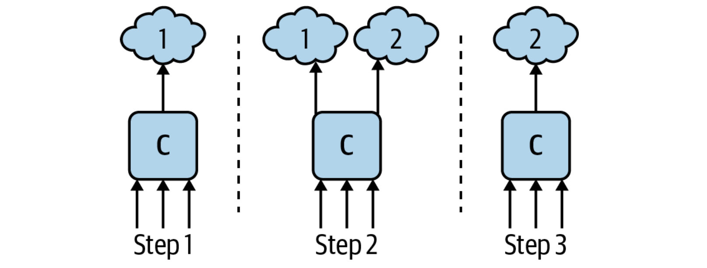

也可以使用 OpenTelemetry 在多個供應商之間進行測驗。你可以同時向多個系統發送遙測信息，並直接比較系統，看哪一個最適合你的需要。

# 第 8 章：如何在組織中推廣 OpenTelemetry

上線一個新的遙測系統可能是一項複雜的工作。它需要整個工程組織的支持，不能一蹴而就。不要低估這可能會產生的問題！

在大型組織中，通常有許多服務團隊負責系統的不同部分。通常情況下，每個團隊都需要付出一定的努力來使他們所管理的服務得到充分的工具化。而這些團隊都有自己積壓的工作，他們當然希望能夠優先處理這些工作。

不幸的是，可觀測性計劃在開始提供價值和證明其價值之前就會耗盡人的耐心。但通過仔細的計劃和協調，這種情況是可以避免的。

## 主要目標

在推廣 OpenTelemetry 時，重要的是要記住，任何基於分佈式追踪的可觀測性系統都需要對參與事務的每個服務進行檢測，以提供最大價值。如果只有部分服務被檢測到，那麼追踪就會被分割成小的、不相連的部分。

這種散亂的儀表的結果是不可取的。這種情況——不一致的儀表和斷裂的追踪是你想要避免的主要事情。如果追踪是斷開的，運維人員仍然需要在他們的頭腦中把所有的東西拼湊起來，以獲得他們系統的情況。更糟糕的是，自動分析工具可以使用的數據非常有限。與人類運維人員不同，他們可以運用直覺，跳出框框來思考問題，而分析工具卻只能使用他們得到的數據。由於數據有限，他們提供有用的見解的機會也將是有限的。

為了避免這個陷阱，集中精力對一個工作流程進行檢測，在進入下一個工作流程之前對其進行完整的追踪。大多數工作流程並不涉及大系統的每一個部分，所以這種方法將最大限度地減少分析開始和價值實現之前所需的工作量。

## 選擇一個高價值的目標

談到實現價值，在開始進行儀表測量工作時，重要的是要有一個有吸引力的目標！這一點很重要。

最有可能的是，有一個特別的問題促使人們去部署 OpenTelemetry。如果是這樣的話，就把重點放在解決該問題所需的最小的推廣上。否則，想一想那些眾所周知的問題，解決它們就值得公佈了。

目前有哪些痛苦的、長期的問題在困擾著運維？減少系統延遲在哪裡可以直接轉化為商業價值？當人們問 "為什麼這麼慢？" 時，他們說的是系統的哪一部分？在選擇第一個工作流程時，請以這些信息為指導。

識別一個有吸引力的目標有兩個好處。首先，它可以更有利於說服眾人，因為有一個具體的理由來做這項工作。這使得它更容易說服有關團隊優先考慮增加指導，並以協調的方式進行。

第二，速戰速決給你的新的可觀測性系統一個閃亮的機會。第一次通過分佈式追踪的視角來分析一個軟件系統時，幾乎總是會產生有用的見解。證明可觀測性的價值可以引起很多人的興趣，並有助於降低採用時任何揮之不去的障礙。

如果直接進入生產是困難的，"生產支持" 系統也是一個好的開始。可以對 CI/CD 系統進行檢測，以幫助了解構建和部署的性能。在這裡，整個組織都會感受到性能的大幅提升，並可以為將 OpenTelemetry 轉移到生產中提供良好的理由。

## 集中遙測管理

展開和管理遙測系統從集中化中獲益良多。在一些組織中，會有一個平台或信息結構團隊可以接觸到每一項服務。像這樣的團隊是集中管理遙測的一個好地方，這可以提供巨大的幫助。遙測管道最好被認為是它自己的系統；允許一個團隊操作整個遙測管道，往往比要求許多團隊各自擁有系統的一部分要好。

在軟件層面，將 OpenTelemetry 設置與已經廣泛部署的代碼管理工具——例如共享的啟動腳本和應用框架整合起來，減少了每個團隊需要管理的代碼量。這有助於確保服務與最新的版本和配置保持同步，並使採用更加容易。

另一個關鍵工具是一個集中的知識庫。 OpenTelemetry 有文檔，但它是通用的。創建特定於在你的組織內部署、管理和使用 OpenTelemetry 的文檔。大多數工程師都是第一次接觸 OpenTelemetry 和分佈式追踪，這對他們的幫助怎麼強調都不為過。

## 先廣度後深度

還有一個關於合理分配精力的說明。當對一個工作流程進行端對端檢測時，通常只需安裝 OpenTelemetry 附帶的儀表，加上你的組織所使用的任何內部或自創框架的儀表即可。沒有必要深入檢測應用程序代碼，至少在開始時沒有必要。 OpenTelemetry 附帶的標準跨度和指標足以讓你識別大多數問題；必要時可以有選擇地增加更深層次的檢測。在添加這種細節之前，請確保你已經建立並運行了端到端的追踪。

這就是說，有一個快速的方法可以為你的追踪增加很多細節，那就是把任何現有的日誌轉換成追踪事件。這可以通過創建一個簡單的日誌附加器來實現，它可以抓取當前的跨度，並將日誌作為一個事件附加到它上面。現在，當你查找追踪時，你所有的應用日誌都可以得到，這比在傳統的日誌工具中尋找它們要容易得多。 OpenTelemetry 確實為一些常見的日誌系統提供了日誌附加程序，但它們也很容易編寫。

## 與管理層合作

如果你是一個工程師在讀這篇文章，我有一個補充說明。推廣一個新的遙測系統可能需要組織很多人。幸運的是，有些人已經在做這種組織工作了 —— 經理們！這就是我們的工作。

但是，如果你想啟動其中的一個項目，說服工程或項目經理來幫助你是很好的第一步。他們將對如何完成項目有寶貴的見解，並能在你可能不參加的會議上推銷該項目。有時候，組織人比組織代碼更難，所以不要害怕尋求幫助！

## 加入社區

最後，在個人和組織層面上，考慮加入 OpenTelemetry 社區！維護者和項目負責人都很友好，非常平易近人。社區是一個很好的獲取援助和專業知識的資源的地方；我們總是很樂意幫助新的用戶得到指導。還有一種汗水文化：如果有你想看到的 OpenTelemetry 功能，加入一個工作組並提供幫助是使它們得到優先考慮的一個好辦法。

至少，一定要給我們反饋。我們從用戶那裡聽到的越多，我們就越能專注於最重要的問題。我們的目標是建立一個推動下一代可觀測性的標準。沒有你，我們做不到，我們的大門永遠是敞開的。

## 謝謝你的閱讀

我希望你喜歡這份關於 OpenTelemetry 的可觀測性的未來的報告。如果你有任何問題、評論、反饋或基於你所讀的內容的靈感，請隨時在 Twitter 上與我聯繫，我是 @tedsuo。

要想獲得 OpenTelemetry 的幫助，請加入雲原生計算基金會（CNCF）Slack 上的 #OpenTelemetry 頻道。我希望能在那裡見到你！

# 附錄 A：OpenTelemetry 項目組織

OpenTelemetry 是一個大型項目。 OpenTelemetry 項目的工作被劃分為**特殊興趣小組**（SIG）。雖然所有的項目決策最終都是通過 GitHub issue 和 pull request 做出的，但 SIG 成員經常通過 CNCF 的官方 Slack 保持聯繫，而且大多數 SIG 每週都會在 Zoom 上會面一次。

任何人都可以加入一個 SIG。要想了解更多關於當前 SIG、項目成員和項目章程的細節，請查看 GitHub 上的 [OpenTelemetry 社區檔案庫](https://github.com/open-telemetry/community)。

## 規範

OpenTelemetry 是一個規範驅動的項目。 OpenTelemetry 技術委員會負責維護該規範，並通過管理規範的 backlog 來指導項目的發展。

小的改動可以以 GitHub issue 的方式提出，隨後的 pull request 直接提交給規範。但是，對規範的重大修改是通過名為 OpenTelemetry Enhancement Proposals（OTEPs）的徵求意見程序進行的。

任何人都可以提交 OTEP。 OTEP 由技術委員會指定的具體審批人進行審查，這些審批人根據其專業領域進行分組。 OTEP 至少需要四個方面的批准才能被接受。在進行任何批准之前，通常需要詳細的設計，以及至少兩種語言的原型。我們希望 OTEP 的作者能夠認真對待其他社區成員的要求和關注。我們的目標是確保 OpenTelemetry 適合盡可能多的受眾的需求。

一旦被接受，將根據 OTEP 起草規範變更。由於大多數問題已經在 OTEP 過程中得到了解決，因此規範變更只需要兩次批准。

## 項目治理

管理 OpenTelemetry 項目如何運作的規則和組織結構由 OpenTelemetry 治理委員會定義和維護，其成員經選舉產生，任期兩年。

治理成員應以個人身份參與，而不是公司代表。但是，為同一雇主工作的委員會成員的數量有一個上限。如果因為委員會成員換了工作而超過了這個上限，委員會成員必須辭職，直到雇主代表的人數降到這個上限以下。

## 發行版

OpenTelemetry 有一個基於插件的架構，因為有些觀察能力系統需要一套插件和配置才能正常運行。

發行版（**distros**）被定義為廣泛使用的 OpenTelemetry 插件的集合，加上一組腳本或輔助功能，可能使 OpenTelemetry 與特定的後端連接更簡單，或在特定環境中運行 OpenTelemetry。

需要澄清的是，如果一個可觀測性系統聲稱它與 OpenTelemetry 兼容，那麼它應該總是可以使用 OpenTelemetry 而不需要使用某個特定的發行版。如果一個項目沒有經過規範過程就擴展了 OpenTelemetry 的核心功能，或者包括任何導致它與上游 OpenTelemetry 倉庫不兼容的變化，那麼這個項目就是一個分叉，而不是一個發行版。

## 註冊表

為了便於發現目前有哪些語言、插件和說明，OpenTelemetry 提供了一個註冊表。任何人都可以向 [OpenTelemetry 註冊表](https://opentelemetry.io/registry/)提交插件；在 OpenTelemetry 的 GitHub 組織內託管插件不是必須的。

Copyright © 2017-2022 | 基於 CC 4.0 協議 發布 | MarcusTung.io all right reserved